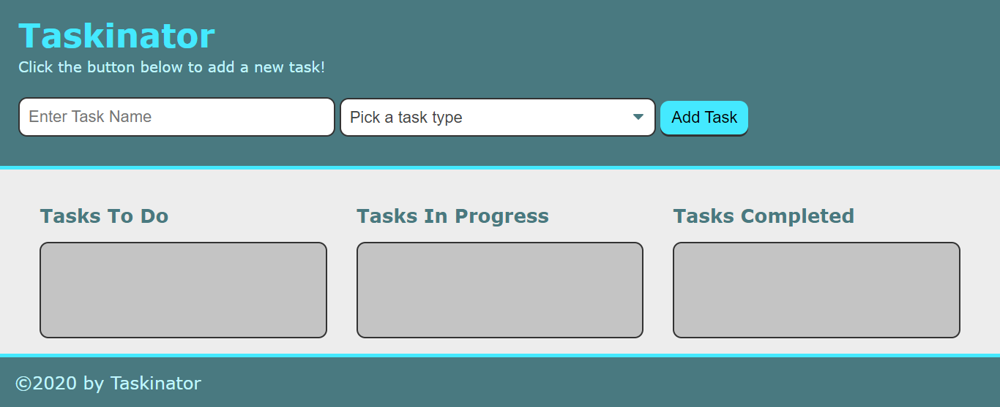

# taskinator

# Password Generator

## Description

This project was a lesson in utilizing the web api to create a taskbuilder. Also
learning about local storage, the DOM, and going more in depth in javascript functions.

## Table of Contents 

- [Installation](#installation)
- [Screenshot](#sceenshot)
- [Credits](#credits)
- [Link](#link)

## Installation

Clone the repository in a CLI using the command `git clone` to download all source files.

## Screenshot

## Credits

Starter code was provided by Vanderbilt Coding Boot Camp.

## Link

You can find the live deployed project [here](https://strayfrozen.github.io/taskinator/)

